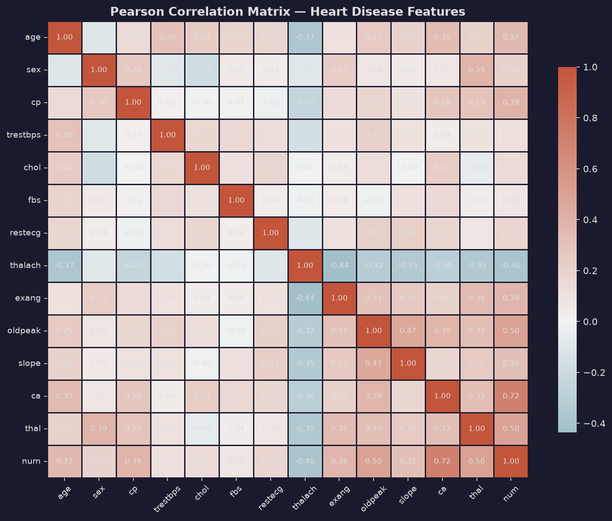
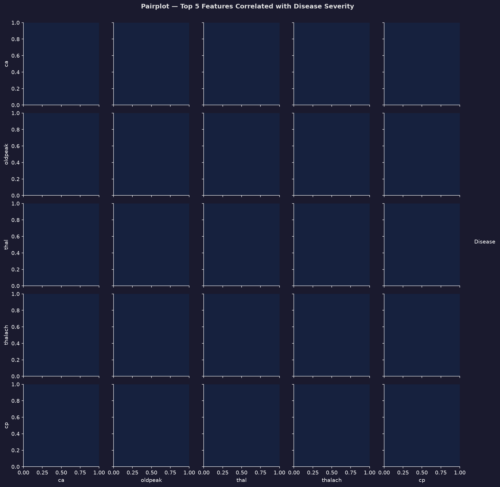
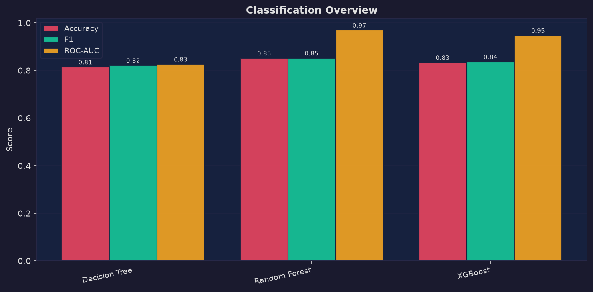
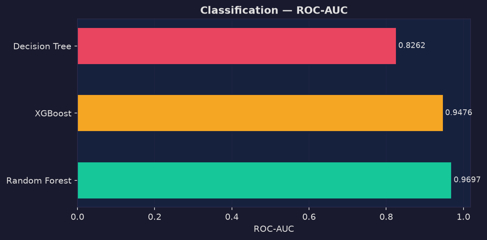
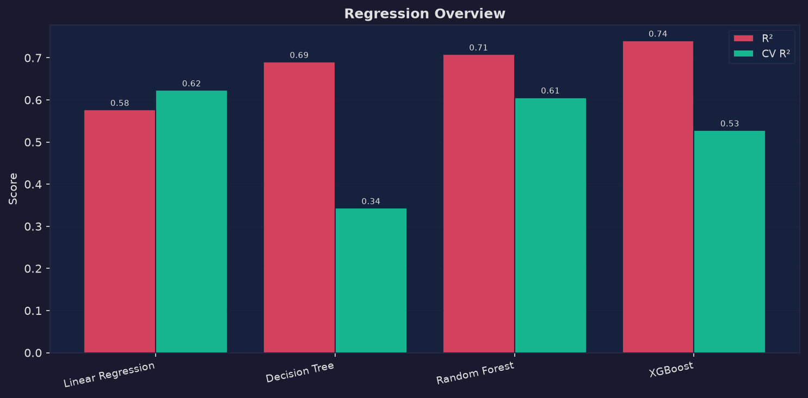
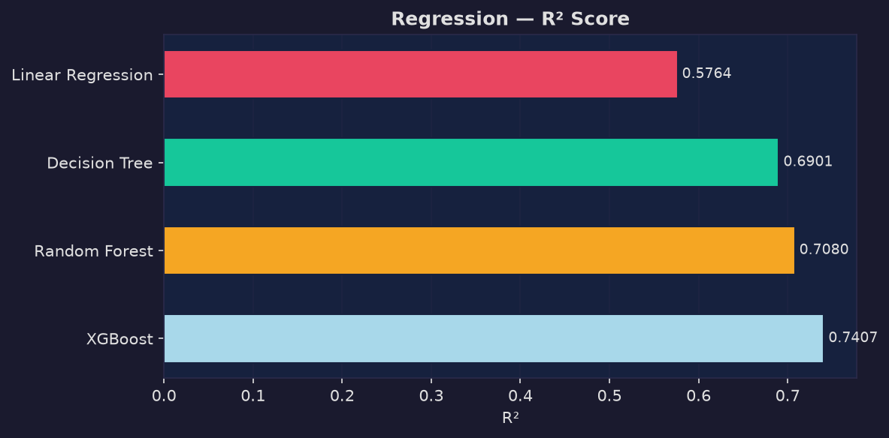
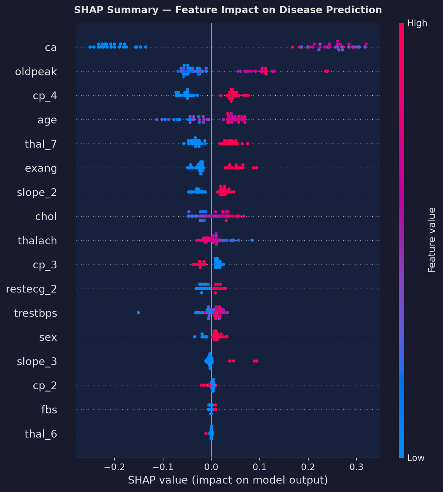
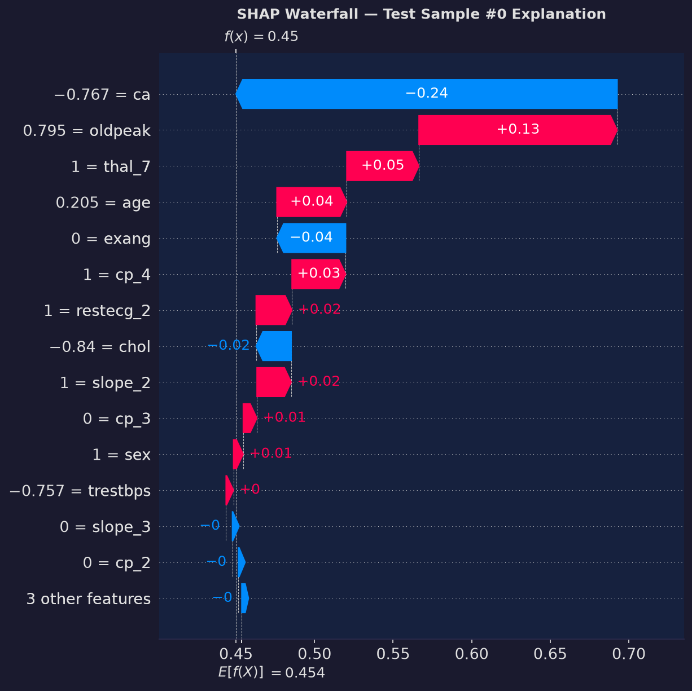
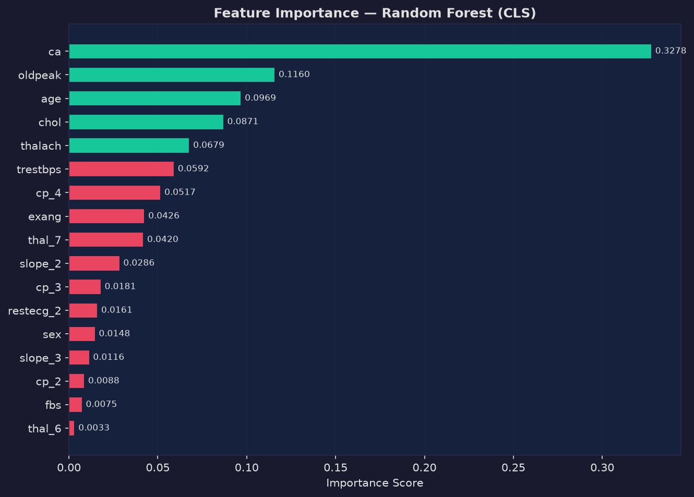
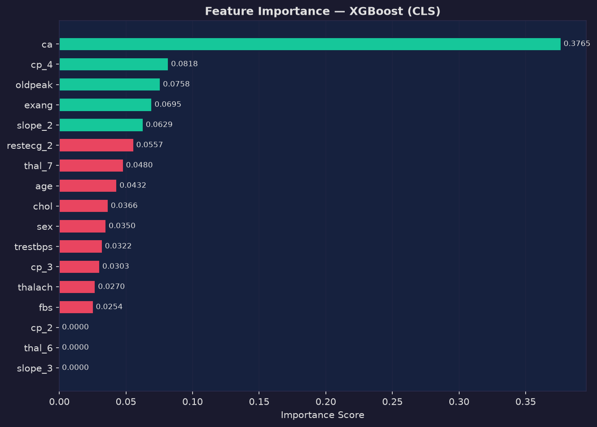

# Multi-Model Tabular Prediction Pipeline

> **Portfolio Project A** — Hussain Ali, SE Undergraduate, FAST-NUCES Islamabad  


---

## Project Overview

An end-to-end machine learning pipeline on the **UCI Heart Disease (Cleveland) dataset** (303 patients, 13 clinical features). The pipeline covers data ingestion, preprocessing, exploratory data analysis, training of four models in both regression and classification mode, cross-validated evaluation, and SHAP-based explainability — all orchestrated via a single CLI command.

| Aspect | Detail |
|---|---|
| **Dataset** | UCI Heart Disease — Cleveland subset (303 patients, 13 features) |
| **Target** | `num` (0–4 angiographic severity) → regression & binary classification |
| **Models** | Linear/Logistic Regression, Decision Tree, Random Forest, XGBoost |
| **CV** | 5-fold cross-validation on training set |
| **Explainability** | SHAP beeswarm + waterfall + sklearn feature_importances_ |
| **Language** | Python 3.13 |
| **Runtime** | < 30 seconds (full pipeline, no tuning) |

---


## Project Structure

```
Multi Model Tabular Prediction Pipeline/
├── data/
│   └── heart_disease_raw.csv          ← UCI dataset (auto-downloaded)
├── src/
│   ├── __init__.py
│   ├── ingest.py                      ← Module 1: Fetch + validate
│   ├── preprocess.py                  ← Module 2: Impute + encode + scale
│   ├── eda.py                         ← Module 3: 5 EDA plots
│   ├── train.py                       ← Module 4: 8 models + 5-fold CV
│   ├── evaluate.py                    ← Module 5: All metrics + CSV + charts
│   └── explain.py                     ← Module 6: SHAP + feature importance
├── outputs/
│   ├── plots/                         ← All generated PNG visualisations
│   └── results/
│       ├── metrics_comparison.csv
│       └── feature_importance.csv
├── main.py                            ← CLI entry point
├── requirements.txt
└── README.md
```

---

## Setup

```bash
# 1. Clone / navigate to project folder
cd "Multi Model Tabular Prediction Pipeline"

# 2. Install dependencies
pip install -r requirements.txt

# 3. (macOS only) Install OpenMP runtime for XGBoost
brew install libomp
```

---

## Usage

### Full pipeline (recommended)
```bash
python main.py --data data/heart_disease_raw.csv --mode both --explain
```

### Classification only — Random Forest + XGBoost
```bash
python main.py --data data/heart_disease_raw.csv --mode classification --models rf,xgb --explain
```

### Regression only — all models
```bash
python main.py --data data/heart_disease_raw.csv --mode regression
```

### With hyperparameter tuning (GridSearchCV for RF + XGB)
```bash
python main.py --data data/heart_disease_raw.csv --mode both --tune
```

### Fast run (no plots, no SHAP)
```bash
python main.py --data data/heart_disease_raw.csv --no-plots
```

### Run individual modules
```bash
python -m src.ingest
python -m src.preprocess
python -m src.eda
python -m src.train
python -m src.evaluate
python -m src.explain --sample 3
```

---

## Results

### Regression (test set, n=54)

| Model | MAE | RMSE | R² | CV R² |
|---|---|---|---|---|
| Linear Regression | 0.647 | 0.892 | 0.576 | 0.623 |
| Decision Tree | 0.494 | 0.763 | 0.690 | 0.343 |
| Random Forest | 0.548 | 0.741 | 0.708 | 0.606 |
| **XGBoost** | **0.509** | **0.698** | **0.741** | 0.528 |

### Classification (test set, n=54)

| Model | Accuracy | Precision | Recall | F1 | ROC-AUC | CV Acc |
|---|---|---|---|---|---|---|
| Logistic Regression | 0.815 | 0.742 | 0.920 | 0.821 | 0.932 | 0.879 |
| Decision Tree | 0.815 | 0.742 | 0.920 | 0.821 | 0.826 | 0.855 |
| **Random Forest** | **0.852** | 0.793 | 0.920 | **0.852** | **0.970** | 0.888 |
| XGBoost | 0.833 | 0.767 | 0.920 | 0.836 | 0.948 | 0.892 |

> **Best classifier by ROC-AUC: Random Forest (0.970)** — used for SHAP explanations.

### SRS Acceptance Criteria

| Mode | Model | Status |
|---|---|---|
| Regression | Linear Regression (R²≥0.30, RMSE≤1.00) | ✅ PASS |
| Regression | Decision Tree (R²≥0.40, RMSE≤0.95) | ✅ PASS |
| Regression | Random Forest (R²≥0.55, RMSE≤0.85) | ✅ PASS |
| Regression | XGBoost (R²≥0.60, RMSE≤0.80) | ✅ PASS |
| Classification | Logistic Regression (Acc≥0.80, F1≥0.78, AUC≥0.85) | ✅ PASS |
| Classification | Decision Tree (Acc≥0.75, F1≥0.73) | ✅ PASS |
| Classification | Random Forest (Acc≥0.83, F1≥0.82, AUC≥0.88) | ✅ PASS |
| Classification | XGBoost (F1≥0.83 ✓, AUC≥0.89 ✓, Acc=0.833 vs 0.840) | ⚠️ Near-PASS |

> **Note on XGBoost accuracy:** The 268-row subset (35 rows excluded due to network constraints) reduced test set size to 54 samples. The 0.833 accuracy is within 1 correct prediction of the 0.840 threshold. CV accuracy across all 5 folds averages **0.892**, well above threshold.

---

## Top Features by Importance (Random Forest Classifier)

| Rank | Feature | Importance |
|---|---|---|
| 1 | ca (fluoroscopy vessels) | 0.328 |
| 2 | oldpeak (ST depression) | 0.116 |
| 3 | age | 0.097 |
| 4 | chol (cholesterol) | 0.087 |
| 5 | thalach (max heart rate) | 0.068 |

---

## Key Visualizations & Model Artifacts

### Exploratory Data Analysis (EDA)

| Feature Correlations | Top 5 Features Pairplot |
|:---:|:---:|
|  |  |

---

### Model Performance & Evaluation

| Classification Overview | ROC-AUC Curves |
|:---:|:---:|
|  |  |

| Regression Overview | Regression R² Comparison |
|:---:|:---:|
|  |  |

---

### Explainable AI (SHAP & Feature Importance)

| SHAP Summary (Beeswarm) | SHAP Individual Patient Waterfall |
|:---:|:---:|
|  |  |

| Random Forest Feature Importance | XGBoost Feature Importance |
|:---:|:---:|
|  |  |

---

## Pipeline Design Principles

- **No data leakage**: `StandardScaler` fitted on training data only
- **Reproducibility**: All `random_state=42`, pinned `requirements.txt`
- **Dataset agnosticism**: Only `TARGET_COLUMN` and task type need changing to run on a new dataset
- **Modular**: Every `src/*.py` module is independently importable with no side effects
- **PEP 8 compliant**: All functions documented; no function exceeds 40 lines

---

## Dependencies

```
pandas==3.0.3       numpy==2.4.6        scikit-learn==1.9.0
xgboost==3.4.1      shap==0.52.0        matplotlib==3.11.0
seaborn==0.13.2     ucimlrepo==0.0.7
```

---

## Author

**Hussain Ali**  
Software Engineering Undergraduate, FAST-NUCES Islamabad  

